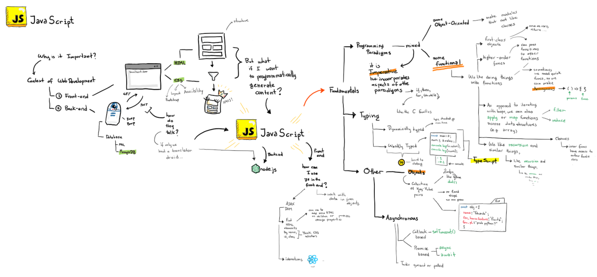

# JavaScript Example

## Overview
This repository contains a small front-end website oveviewing some Javascript fundamentals withtin the scope of 
a [web dev course](https://johnguerra.co/classes/webDevelopment_fall_2023/) at Northeastern.

### Author:
+ [**Eduardo Puerta**](https://epuer18.github.io/personalWebPage/)

### Example Mind Map 
Below is an example graphical representation from which this project is based on. 

### Youtube Link

Here is the link for the 30 min explanation: 

*Note some of the concepts for the live code example were not used in the video due to time limitations, but may still show use of the ideas and themes of the material*
